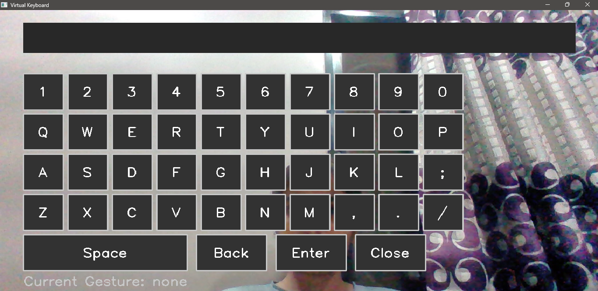

# 🖐️ Virtual Hand Gesture Keyboard

A real-time virtual keyboard controlled by hand gestures using OpenCV, CVZone, and Python. Enables contactless typing — ideal for accessibility, touchless UI, and gesture-based interaction demos.

---

## 📌 Features

- 👆 **Pointing**: Use your index finger to hover over keys
- 🤏 **Pinch Gesture**: Simulates a keypress (like a click)
- ✌️ **Peace Sign**: Types a space
- ✊ **Fist Gesture**: Backspace
- 👍 **Thumbs Up**: Enter key (newline)
- ❌ **Close Button**: Exit app by pinching on "Close"

---

## 🧠 Technologies Used

- Python 3.x
- OpenCV (`opencv-python`)
- CVZone (`cvzone`)
- Pynput (`pynput`)
- NumPy (`numpy`)

---

## 🖼️ UI Preview

  

---

## 🔧 Installation

```bash
pip install opencv-python cvzone pynput numpy
